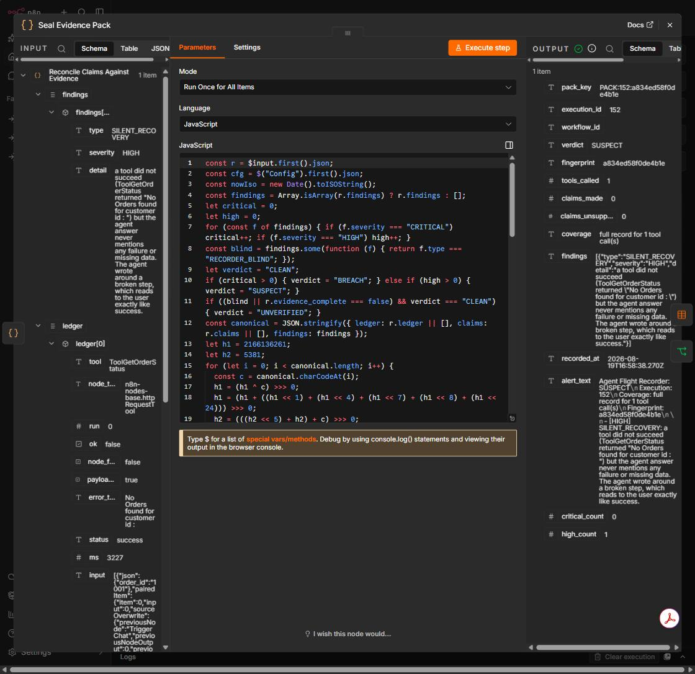

# The Trust Loop

Eight stages an AI automation should pass before anyone depends on it, built as importable n8n workflows.

It started as a single workflow and turned into something I actually wanted to argue about, so I wrote it
down properly.



That screenshot is a fresh import of
[`workflows/agent-flight-recorder.json`](workflows/agent-flight-recorder.json) from this repository into
an empty n8n workflow, run with **no credentials and no data tables configured**. The agent it is
examining reported success. Its tool had returned `{"error": "No Orders found for customer id :  "}`
inside an HTTP 200, and the answer never mentioned it.

You should get the same fingerprint, `a834ed58f0de4b1e`. If you do not, one of us is wrong and the
difference is inspectable — see [`docs/09-run-it-yourself.md`](docs/09-run-it-yourself.md). CI checks
that number on every push, because this repo has already shipped a workflow its own documentation
called broken.

---

## The problem I kept running into

Regulated software and LLM features are built under opposite defaults. In one, nothing ships without its evidence.
In the other, the feature ships and the evidence is optional. Putting the two side by side makes one thing obvious.

When a normal piece of software breaks, it stops. You get a stack trace, a red build, a 500. When an AI workflow
breaks, it very often **succeeds** — green tick, no error, output that is quietly wrong. Nobody has a category for
that, so nobody tests for it, so the first time it happens is in production on somebody's real invoice.

Everything here is aimed at that gap. Not "does the model work" — that question is easy and mostly answered. The
question is *"can I show that it worked, and would I notice if it stopped?"*

## The eight stages

| Stage | The question it answers | Workflows here |
|---|---|---|
| 1. Decide | Should this even be an agent? | **Determinism Advisor** |
| 2. Build | What should the platform offer before I ask for it? | **Skill Extractor** |
| 3. Prove | Does it do the job, repeatably, without costing money to check? | **Replay Cassette** |
| 4. Attack | What happens when the input is hostile or the world is broken? | Non-Determinism Fuzzer |
| 5. Ship | Is it safe to let this out? | The Airlock, Blast Radius Preflight |
| 6. Run | Is it still doing the job today? | **Platform Sentinel**, **Agent Flight Recorder**, Silent Success Detector, Agent Intent Drift |
| 7. Recover | It went wrong. Can we undo it and explain it? | Compensating Rollback |
| 8. Learn | What did we learn, and who else should benefit? | **Regret Log**, **Trust Ledger**, **Community Failure Miner** |

Stage 8 is what makes it a loop rather than a checklist, and it is the stage almost nobody builds. Draw it as a
circle, not a pipeline.

The eight workflows in **bold** are in `workflows/` as importable JSON. The rest exist in my n8n instance and are
described in the docs; I have not exported them because they are earlier drafts and I would rather show you eight
things I stand behind than eighteen I half-do.

## Start here

If you only open one file, open [`docs/03-determinism-advisor.md`](docs/03-determinism-advisor.md). It is the one I
would defend hardest, and it is the only workflow here that argues a product should do *less*.

If you want to see something that actually executes rather than models, open
[`docs/04-replay-cassette.md`](docs/04-replay-cassette.md). That one is a live webhook, and it is explicit about which half of it is stubbed.

If you want to know what I think is wrong with this repo, open
[`docs/06-limitations.md`](docs/06-limitations.md). I would read that one second.

If you would rather see the argument fail in practice than be asserted, open
[`docs/07-platform-sentinel.md`](docs/07-platform-sentinel.md). I built a monitoring workflow, its
first run reported GREEN across the board, and it had actually checked one seventh of what it
claimed. Four bugs, an execution log, and the fix that makes GREEN something the tool has to earn.
It has since failed twice more, in ways I did not predict and would not have found by testing it:
once by reasoning correctly from evidence that had been deleted underneath it, and once by sending a
perfectly correct alert every fifteen minutes until it became wallpaper. Those are Parts 7 and 8.

If you want the one that thinks ahead rather than backwards, open
[`docs/08-agent-flight-recorder.md`](docs/08-agent-flight-recorder.md). Three open n8n issues mean an AI agent cannot
prove what it did. That doc works out what breaks *after* those three are fixed, and builds the detectors for the
second set of problems rather than the first. Then one of those detectors caught a real case on a live agent run
that n8n had marked successful, before the fix it was predicting had even shipped. That part is Part 5.

## How to run these

1. In n8n, go to **Workflows → Import from File** and pick any JSON in `workflows/`.
2. Every workflow runs on a **Manual Trigger** or a **Schedule Trigger**, with one exception: Replay Cassette uses a
   **Webhook**, so you need to activate it or use Test URL.
3. **Seven of the eight need no credentials.** Nothing in them calls a paid API. Input data is seeded in Code nodes so
   the graph runs end to end on a fresh instance with nothing configured. That is deliberate, and it is also the
   biggest honest limitation — see `docs/06-limitations.md`.
   The **Agent Flight Recorder** now ships with a synthetic execution record switched on, so it runs on a bare
   instance too: import it, press Execute, and you should get verdict `SUSPECT` with fingerprint
   `a834ed58f0de4b1e`. If your fingerprint differs, one of us is wrong and the difference is inspectable — that is
   the closest thing to a self-verifying artefact in here.
   **Platform Sentinel** is the one exception and stays that way on purpose: it audits a real instance through its
   own API, so a synthetic mode would be a tool reporting a status having checked nothing, which is the exact
   failure `docs/07` is about. It needs an n8n API credential and three Data Tables.
   **Full setup, table schemas and expected output: [`docs/09-run-it-yourself.md`](docs/09-run-it-yourself.md).**
4. Read the sticky notes. They carry the reasoning, not just the labels.

## Repository layout

```
docs/
  01-why-this-exists.md          the thesis, in one page
  02-the-eight-stages.md         the architecture and why it is a loop
  03-determinism-advisor.md      deep dive on the flagship
  04-replay-cassette.md          deep dive on the live endpoint, and what inside it is stubbed
  05-what-i-would-ship-first.md  prioritisation, with the reasoning shown
  06-limitations.md              what is stubbed, what I would fix, in what order
  07-platform-sentinel.md        a monitor, the four bugs it hid from me, and the fix
  08-agent-flight-recorder.md    proving what an AI agent did, and the bugs that arrive after the fix
  09-run-it-yourself.md          how to run these without my instance, and the number you should get
fixtures/
  agent-execution-silent-recovery.json   invented agent run: green tick, failed tool, answer that hides it
tests/
  verify.mjs                     shape, anonymity, and the fingerprint the docs promise. CI runs this
workflows/
  determinism-advisor.json       10 nodes
  replay-cassette.json           10 nodes, live webhook
  skill-extractor.json           10 nodes
  regret-log.json                10 nodes
  trust-ledger.json              10 nodes
  community-failure-miner.json   10 nodes
  platform-sentinel.json         33 nodes, audits a live instance, needs credentials
  agent-flight-recorder.json     17 nodes, rebuilds what an agent really did, runs on the fixture as shipped
```

## A note on size

Six of the eight workflows here are ten nodes. That is on purpose and I expect to be asked about it.

I could have built one sprawling sixty-node monster and it would have looked more impressive in a screenshot. It would
also have contradicted the first thing this repo argues, which is that the cheapest reliability win available to
anyone is **less surface area**. A ten-node workflow that a stranger can read without me standing next to it is worth
more than a sixty-node one that only I can maintain — and if I am wrong about that, then the Determinism Advisor is
wrong too, and I would rather find that out in a conversation than hide it behind node count.

Two workflows break that preference, and both earned their size differently.

Platform Sentinel is 33 nodes. Seven independent checks that must converge into a single alert genuinely need the
parallel-then-merge shape, so the size is defensible. It was not free. Three of the four bugs I found in it were wiring
and state-handling bugs of exactly the kind a ten-node workflow has no room to contain, and
[`docs/07-platform-sentinel.md`](docs/07-platform-sentinel.md) is the receipt.

The Agent Flight Recorder is 15 nodes, which is closer to the preference than to the exception. It still shipped with a
deduplication bug on its second run. Small helps. It does not save you.

I should be careful how hard I state this. Eighteen workflows on one instance is not a sample anyone should
generalise from, and n8n can see patterns across a very large number of real workflows that I cannot. So this is
a preference I can defend on my own small evidence, not a finding. The question I would actually want answered is
whether failure rate correlates with node count in real usage once you control for what the workflow touches, and
that is a question only someone with the telemetry can settle. If the answer is no, I would like to know.


## Licence

MIT. Take any of it.
