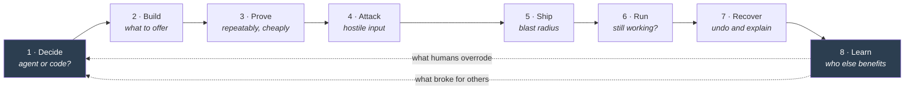

# The eight stages

An AI automation passes through eight questions on its way from idea to something people rely on. Most tooling
addresses two of them, testing and monitoring, and leaves the other six to habit.

I ordered them by when the question first becomes answerable, not by importance. Stage 1 is cheapest to get right and
most expensive to get wrong.

---

## 1. Decide: *should this even be an agent?*

**Workflow:** `determinism-advisor.json`

Before anything else: does this step need a model at all? Three rules, applied per step:

- Irreversible **and** high blast radius → **a human decides.** Judgement is cheap. An unrecoverable mistake is not.
- Open-ended judgement over unstructured input → **an agent.** This is the only part a model is genuinely needed for.
- Everything else → **deterministic code.** A model here buys nothing and adds variance.

Getting this wrong is the single most common and least discussed AI reliability failure. Deep dive:
[`03-determinism-advisor.md`](03-determinism-advisor.md).

## 2. Build: *what should the platform offer before I ask for it?*

**Workflow:** `skill-extractor.json`

Reusable building blocks (Skills, templates, sub-workflows) are almost always chosen by whoever is writing them,
then pushed at users who did not ask. Invert it: watch what people actually wire, find the sub-shapes that
**independent** builders rebuild from scratch, and propose those.

The bar is independence, not frequency. One person repeating a shape is a habit. Three unrelated people converging on
the same five nodes is evidence of a missing primitive. So the filter is distinct builders and the ranking is
builders × shape length: how many people, times how much wiring it removes.

## 3. Prove: *does it work, repeatably, without costing money to check?*

**Workflow:** `replay-cassette.json`

An OpenAI-compatible endpoint that records a model response once and replays it byte-identically forever. The key is a
hash of the canonical request (model, temperature, tools, the full message array) so changing one word of a prompt
produces a different key, a cache miss, and a fresh recording. **A prompt edit invalidates its own tape**, which is
what makes replay safe rather than dangerous.

This is the stage everything else depends on. Deep dive: [`04-replay-cassette.md`](04-replay-cassette.md).

## 4. Attack: *what happens when the input is hostile or the world is broken?*

Not exported here; described for completeness.

The Non-Determinism Fuzzer injects twelve deliberate faults at two injection points: malformed JSON, truncated
response, empty string, model refusal, timeout, HTTP 429, HTTP 500, duplicate tool call, wrong-type field, ten-times
latency, Unicode edge cases, null instead of object. It sorts the reactions into four buckets: survived, degraded
gracefully, crashed, and **silently wrong**.

That fourth bucket is the whole point. Crashing is fine; crashing is honest. "Finished successfully while producing
nonsense" is the category that reaches a customer.

## 5. Ship: *is it safe to let this out?*

Not exported here.

The Airlock does admission control: a workflow does not go live until it can name its failure modes, its rollback, and
its blast radius. Blast Radius Preflight asks the question people skip: if this misfires on every input for an hour,
what is the worst thing it can touch? Records changed, emails sent, money moved.

## 6. Run: *is it still doing the job today?*

Not exported here.

The Silent Success Detector watches for the specific pathology from stage 4 appearing in production: executions that
complete without error but whose output has drifted out of its expected shape or distribution. Agent Intent Drift
watches whether an agent is still choosing tools for the reasons it used to.

Ordinary monitoring alerts on errors and latency. Neither of those fires here.

## 7. Recover: *it went wrong. Can we undo it, and explain it?*

Not exported here.

Compensating Rollback is the honest acknowledgement that most AI workflows have side effects you cannot transaction
away. If it sent an email, there is no rollback. There is only a compensating action, and someone has to have decided
in advance what that action is.

## 8. Learn: *what did we learn, and who else should benefit?*

**Workflows:** `regret-log.json`, `trust-ledger.json`, `community-failure-miner.json`

This is the stage that makes it a loop, and the stage almost nobody builds.

- **Regret Log** measures how often a human actually overturns the AI at each approval gate. Under 2% overturned means
  the gate is theatre. It taught people to click Approve without reading, which is worse than no gate because it
  manufactures the appearance of oversight. Over 40% means the model is not doing that job and no prompt will fix it.
  Every override is a free, perfectly-labelled training example that a human already paid for, and today it is thrown
  away the instant the button is clicked.
- **Trust Ledger** grades every template in a library on eval pass rate, fuzz survival, injection resistance, cost
  variance, freshness and incident count, with one rule that makes it honest: **a template with no evals is capped at
  49 out of 100 no matter how popular it is.** Popularity is not evidence. That cap is what turns a badge into an
  incentive, because the only route past a C is to write the evals.
- **Community Failure Miner** ranks community failure reports by pressure: reports × severity, weighted for recency
  and for appearing on more than one channel. Cross-channel confirmation is the signal; upvotes are not. One loud
  person on a forum can out-vote a real defect, but the same complaint appearing independently on GitHub *and* the
  forum *and* Discord almost never happens by accident.

---

## Why a loop and not a pipeline

A pipeline ends. This does not, because the two most valuable signals in the whole system are generated *after*
something ships: what humans overrode, and what broke for other people. Feed those back into stage 1 and the next
workflow starts from a better placement decision than the last one.

The two dotted lines are the whole argument. Stages 1 through 8 are the part everyone draws. The return path is the
part that gets dropped, and it is the only part that makes the next build better than the last one.

Every other trust tool I have used tells you your AI step failed. The interesting version tells you the step should
never have been an AI step, and it can only learn that from the runs that already happened.
