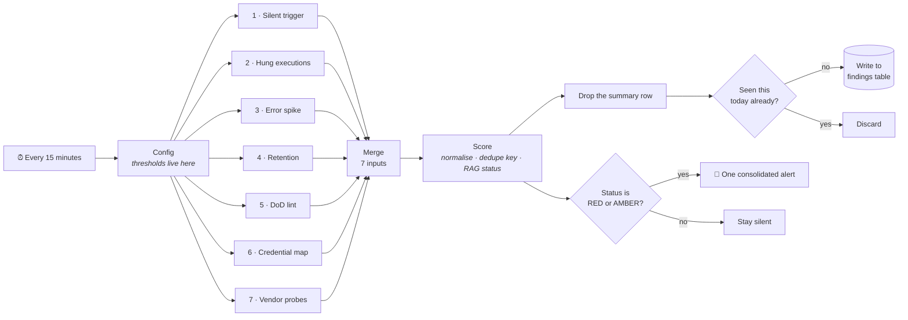
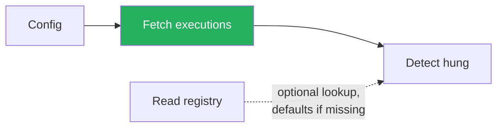
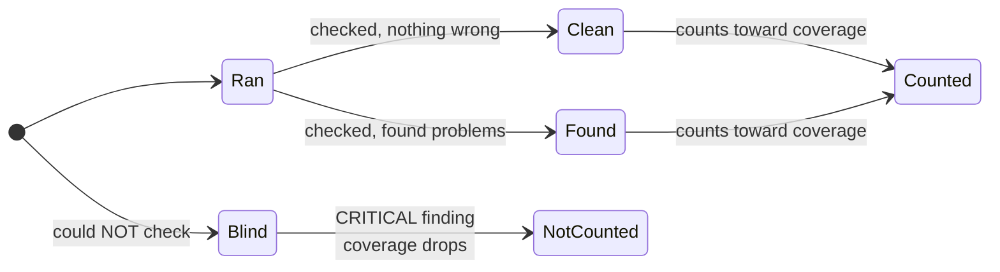
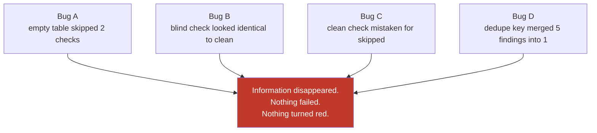
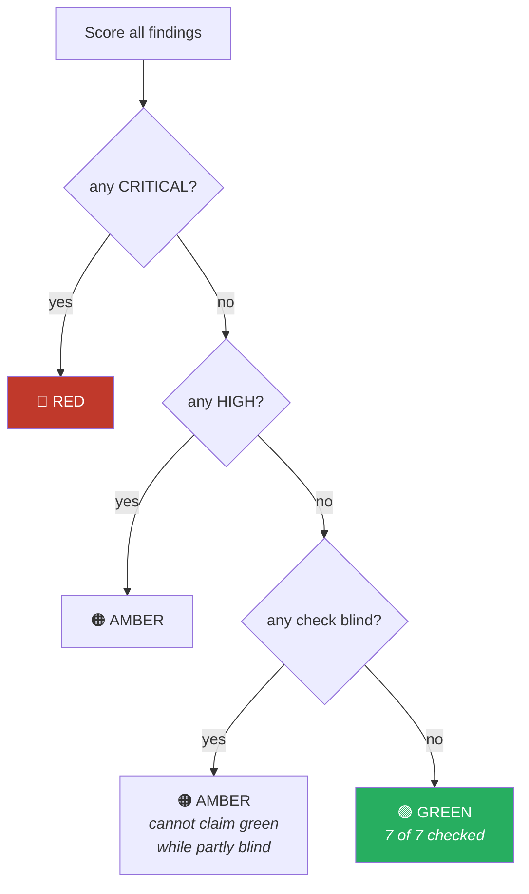

# Platform Sentinel, and the day it lied to me

This is the longest file in the repo, because it is the only one where I have a real execution log to
show you, including the part where the thing I built confidently reported that everything was fine
while checking almost nothing.

Read this one if you want to see the argument in [`01-why-this-exists.md`](01-why-this-exists.md)
applied to my own work rather than to somebody else's.

---

## Part 1. What it is, in plain language

Imagine you own a building with seven smoke detectors in it. Every fifteen minutes someone walks the
building and checks all seven. If any of them is going off, you get one text message listing what is
wrong. If they are all quiet, you get nothing, because a text message every fifteen minutes saying
"still no fire" is how people learn to ignore their phone.

Platform Sentinel is that walk. The building is an n8n instance. The seven detectors are seven
different ways an automation platform quietly rots.

The word doing the heavy lifting there is **quietly**. Every one of these seven failures has the same
shape: nothing crashes, nothing turns red, no error appears anywhere, and the damage accumulates
for days or weeks until somebody happens to look.

### The seven things it watches for

| # | Plain English | The technical name | Why I believe it happens |
|---|---|---|---|
| 1 | A scheduled job stopped running and nobody noticed | Silent trigger death | n8n-io/n8n **#36388**, **#30871**, **#13646**, **#36075**, all open |
| 2 | A job started and never finished, it is still "running" hours later | Hung execution | **#36343**, open: *"Workflow execution timeout is not enforced in queue mode when a node hangs"* |
| 3 | One workflow suddenly started failing a lot | Error spike | no issue needed, this is just counting |
| 4 | Old execution records pile up and never get deleted | Retention breach | operational, not a bug |
| 5 | Live workflows are missing basic safety settings | Definition-of-Done violation | policy, not a bug |
| 6 | A credential is configured but nothing live uses it any more | Orphaned credential | **already covered by `n8n audit`**, see the correction below |
| 7 | An outside service changed its API and our calls now fail | Vendor drift | contract testing, applied to vendors |

Every issue number in that table was checked against the GitHub API at the time of writing: open,
unresolved, and assigned to an n8n team. I am citing them because "triggers sometimes die" is a
rumour and "#13646, open since March 2025, seventeen comments" is a fact. If you are reading this
much later, re-check them. Some of them will have been fixed, and this file will be wrong.

Check 1 deserves a note, because it is the one people find least intuitive. In n8n a workflow has a
toggle marked *Active*. Most people read *Active* as "this is working". It is not. *Active* means
"n8n intends to run this". If the underlying trigger has silently died, and email, database-listener
and IMAP triggers all have known ways of doing exactly that, the workflow still displays as Active
forever while doing nothing at all.

So check 1 does not ask "is it active?". It asks **"when did this last actually succeed?"** and
compares that against how often it is supposed to run. That is a dead-man's switch: the absence of
good news is treated as bad news.

Check 6 needs a correction, and I am leaving the correction visible rather than editing the history.

I originally wrote that n8n cannot tell you which workflows use a given credential, and that check 6
therefore answered a question the product could not. Both halves of that were wrong, and I only found
out because I went looking for the issue numbers to cite.

n8n does two things here already:

- Credentials carry a **"Used by workflows" list and count**. I found this in n8n's own PR #32375,
  filed against the feature because archived workflows were still being counted in it.
- The built-in **security audit** reports `Credentials not used in a workflow`, `Credentials not used
  in an active workflow`, and `Credentials not used in a recently active workflow`. You run it with
  `n8n audit`, or from a workflow via the n8n node under Resource → Audit, Operation → Generate.

That second one is the same question my orphan check asks. I reimplemented a feature that shipped.

What check 6 still adds is narrower than I claimed, and I would rather state the narrow version
accurately than the broad version flatteringly: the audit is a point-in-time report you have to
remember to run, and it returns its own shape. Check 6 runs every fifteen minutes without being
asked, writes findings into the same table and the same severity model as the other six checks, and
so shows up in the same alert. That is an integration argument, not a capability argument.

If I were doing this again I would delete my implementation and call `n8n audit` through the n8n node,
which is both less code and more correct. That is on the list in Part 6.

---

## Part 2. How it is put together



Three design choices in that picture are worth defending.

**The seven branches are genuinely parallel, not sequential.** Every branch hangs directly off
`Config`. Every network call is set to *continue on error*. If the retention check dies, the other
six still run and still report. A monitoring tool that can be taken out by one bad API response is
not a monitoring tool. (This sounds obvious. I got it wrong anyway. See Part 3, Bug A.)

**Everything converges before anything is sent.** Seven checks could easily mean seven alerts. They
merge into one stream, get scored together, and produce exactly one message. The person on call gets
a single paragraph, not a pager storm.

**Silence on GREEN.** No all-clear messages. Running every fifteen minutes means 96 runs a day; 96
"everything is fine" messages is a training programme in ignoring the channel.

### Deduplication, and why it matters more than it sounds

Every finding gets a key built from three things:

```
finding_type : workflow_id : date
```

So `SILENT_TRIGGER:abc123:2026-08-17`. Before a finding is written down, the workflow checks whether
that exact key already exists. If it does, the finding is dropped.

Without this, a workflow that has been dead since Tuesday generates a fresh database row every
fifteen minutes: 96 identical rows a day, ~670 a week, all describing one problem. The signal
drowns in its own repetition. With the key, one problem on one day is one row.

This mechanism turned out to have a sharp edge. See Part 3, Bug D.

---

## Part 3. The part where it lied to me

I built it, validated it, exported it, wrote the documentation, and ran it.

It came back **GREEN**. Zero findings. No alert. Total runtime: 1.8 seconds.

I want to be precise about how good that looked. The execution status was `success`. Every node was
green in the editor. The summary object said `status: "GREEN"`, `total_findings: 0`. If I had put
that screenshot in a slide it would have looked like a clean bill of health for the whole platform.

It was nothing of the sort. Here is what the merge node actually received:

```
[ null, null, null, null, null, {one item}, null ]
```

**Six of the seven checks contributed nothing at all.** One branch out of seven had run. The
platform had not been audited; the audit had barely happened. And the tool's considered summary of
that situation was the word GREEN.

That is the exact failure this repository was written to complain about. From
[`06-limitations.md`](06-limitations.md):

> If a report says "all tests passing" and the reader believes that means "the system works in
> production", the report has done harm.

I wrote that sentence, then built a tool that did it, then nearly shipped the screenshot.

### Why it happened: four separate bugs

Digging into the execution log turned up four distinct defects. What is interesting is not any one of
them. It is that **all four have the same shape**. In every case information disappeared without
anything failing.

---

#### Bug A. Two checks were quietly deleted by an empty table

Checks 2 and 5 were wired like this:


The registry table was empty. In n8n, a node that outputs zero items causes everything downstream of
it to be skipped. Not failed, **skipped**. So the empty table silently deleted checks 2 and 5
entirely.

Check 1 genuinely depends on that table: it watches the workflows you listed there. But check 2 has a
30-minute default and check 5 audits every workflow on the instance. Neither of them needed the table
at all. I had chained them behind it out of convenience.

The fix is boring. Hang them directly off `Config` and look the table up defensively:



**The lesson is not "I mis-wired two nodes."** It is that in a dataflow tool, *empty* and *skipped*
and *fine* all look identical from downstream. That is a property of the tool that you have to design
against, and I didn't.

---

#### Bug B. There was no way to say "I could not check"

This is the one that actually produced the lie.

Five branches did run, and hit the n8n API, and got back `Credentials not found`, because the API
credential had not been attached yet. Each of them handled that gracefully: the response wasn't the
expected shape, so they produced no findings.

**No findings.** Which is byte-for-byte identical to what a branch produces when it checks carefully
and everything is genuinely fine.

The scoring logic counted findings, saw zero, and concluded GREEN. It had no way to know the
difference between these two sentences:

- "I examined the executions and none of them are hung."
- "I could not examine anything."

Both arrive as an empty list. So GREEN was **unfalsifiable**. The tool would report it whether the
platform was healthy or the tool was completely broken. A monitor whose failure mode is a clean bill
of health is worse than no monitor, because no monitor at least does not make anybody confident.

The fix introduces a third state. Every check now reports one of:



A blind check now emits a `CHECK_BLIND` finding at CRITICAL severity, naming itself and the reason.
And the summary gained a coverage figure:

```
Platform Sentinel: RED
Coverage: 2 of 7 checks completed
BLIND: 2-hung-executions, 3-error-spike, 4-retention, 5-dod-lint, 6-credential-map
       - this run did NOT verify those areas
```

Same broken configuration as before. Same missing credential. Completely different message.

The rule that falls out of this, and the single most portable idea in this repo:

> **Coverage is part of the result, not metadata about the result.**
> A status that does not state what it managed to check is not a status. It is a vibe.

---

#### Bug C. Then I overcorrected, and it cried wolf

Having decided that silence was dangerous, my first fix treated *any* branch producing zero output as
suspicious, and flagged it as skipped.

Next run, check 7 got flagged. Check 7 had worked perfectly. It probed three external endpoints, all
three answered 200, nothing was wrong, so it correctly reported nothing. And I called that a critical
failure.

I had replaced a false GREEN with a false alarm, which is the other half of the same mistake.
Silence still could not distinguish "clean" from "skipped", because **silence never can**. Inferring
either meaning from an absence was the error both times.

The real fix stops inferring and starts asking. The scoring node now interrogates each detector node
directly. In n8n, referencing a node that never executed raises an error, while a node that executed
and produced nothing returns an empty list. Those are distinguishable if you ask the right question:

```javascript
try { $("Compare Probe Status").all(); ran["7-vendor-probes"] = true; } catch (e) { }
```

Ugly, and I would like a better mechanism, but it is honest: it tests the thing I actually care about
(did this run?) instead of a proxy for it (did this say anything?).

---

#### Bug D. The deduplication was eating the evidence

Found by re-running after the fix, which is the argument for re-running after a fix.

All five `CHECK_BLIND` findings were being assigned the same key. Remember the format:

```
finding_type : workflow_id : date
```

These findings are about the instance as a whole, so `workflow_id` was empty for all of them. Every
one collapsed to `CHECK_BLIND::2026-08-17`.

The deduplication then did precisely its job: admitted the first, **silently discarded the other
four**. Five critical problems went into the funnel and one came out. The safety mechanism designed
to prevent alert storms was quietly deleting evidence.

Fixed by putting the check's name into the key, so the five are distinct:

```
CHECK_BLIND::2-hung-executions:2026-08-17
CHECK_BLIND::3-error-spike:2026-08-17
...
```

**The lesson:** every deduplication key is a claim that two things are the same. If the key is too
coarse, you are not removing noise, you are destroying data, and you will never see it happen,
because the whole point of the mechanism is to make things disappear.

---

### What the four have in common



Not one of these four bugs produced an error. Not one made a node go red. Every single one made the
tool *more* confident and *less* correct at the same time.

Which is the whole thesis of this repository, and I would not have been able to demonstrate it half
this well if the first run had worked.

---

## Part 4. What the status actually means now



That third branch is the entire point. **GREEN is now unreachable unless all seven checks actually
completed.** Before the fix, GREEN was the default outcome of total failure. Now it is a claim the
tool has to earn.

A correction, added later. Every GREEN this document reports was produced by a manual run. Before
14:30 on 18 August no scheduled execution had ever been recorded, although there is now direct
evidence that many occurred and were discarded unrecorded. The GREEN at 7 of 7 is real. It was
produced by hand. See Part 7.

---

## Part 5. Honest limitations

Same spirit as [`06-limitations.md`](06-limitations.md): here is what I would push back on if I were
reviewing this.

**It breaks this repo's own ten-node rule, and I am not fully comfortable with that.** Every other
workflow here is ten nodes, and the README argues that small surface area is the cheapest reliability
win available. This one is 33 nodes, and three of my four bugs were wiring and state-handling bugs
of exactly the kind that small workflows do not have room to contain. The size is defensible (seven
independent checks that must converge into one alert genuinely need the parallel-then-merge shape)
but it is not free, and the bug count is the receipt.

**The blindness detection is not itself tested.** I know `CHECK_BLIND` fires when credentials are
missing, because that happened. I have not verified it fires on a timeout, a 500, or a malformed
response. The check that catches lies could still be lying in a way I have not provoked yet.

**The alert path is proven, but only recently and only once.** For most of this build it was not.
The alert node fired in every run, and with no credential attached it swallowed its own failure, so
the last link in the chain, the part where a human actually finds out, was never tested. Every check
in this workflow is worthless if the message never arrives, which made that the biggest remaining
gap by some distance and the least interesting thing to work on, which is presumably why it stayed
open the longest.

It has now been closed. A webhook is attached, a non-CLEAN verdict was forced, and the message
arrived in a chat channel with the finding readable in it. Worth being precise about what that
proves: one delivery, on one channel, on a happy path. It does not prove the alert survives the
channel being down, rate limited, or misconfigured, and the `onError` setting on that node means a
delivery failure will no longer take the monitor down with it. It will also no longer be loud about
having failed, which is the same trade this whole document is about, made deliberately this time.

**One key per day may be too coarse in the other direction.** A workflow that dies, gets fixed, and
dies again on the same day produces one record. That is the correct trade for noise, and the wrong
trade for anyone reconstructing a timeline afterwards.

**Check 6 depends on an API returning full node bodies.** If the workflow-list endpoint omits them,
the credential map silently returns an empty index which, yes, is the same failure shape as
everything above. It is now caught by the blindness check, but only because the response fails the
shape test, not because I designed for it.

**The count arm of check 4 cannot fire.** It pages at most 2,500 execution records but the threshold
for "too many retained" is 50,000. The stale-record arm works; the volume arm is decorative until
the page cap is raised. I left it in and wrote it down rather than quietly deleting it.

---

## Part 6. If I were building this for real

In order, and the order is the argument:

1. **Prove the alert arrives.** Everything else is theoretical until a human is demonstrably reachable.
2. **Test the blindness detection deliberately.** Point a branch at a dead endpoint, a slow endpoint,
   and one returning nonsense, and confirm all three produce `CHECK_BLIND`.
3. **Track coverage over time.** Coverage is currently a per-run number. "This check has been blind
   for six days" is a much more useful sentence than "this check is blind", and needs history.
4. **Delete check 6 and call `n8n audit` instead.** My orphan detection duplicates a feature that
   already exists, and mine is the version nobody maintains. Replacing roughly forty lines of Code
   node with one n8n node is a straight win, and the only reason it is fourth on this list rather
   than first is that it removes capability I already have rather than adding capability I lack.
5. **Split it up.** Seven checks in one workflow made three of my four bugs possible. Seven small
   workflows writing to one findings table would be more nodes overall and less coupling, which is
   what this repo argues for everywhere else.

---

## Part 7. The second time it lied, and why this one is worse

Part 3 is about a status that said GREEN while checking almost nothing. This is the inverse, and I think it is
the more interesting failure.

From 23:45 on 17 August until 14:18 the following day, the Sentinel reported SILENT_TRIGGER at CRITICAL against
itself. The detail read "no successful execution in 34 minutes, expected every 15", and the number climbed with
every run.

It was running the whole time.

The workflow's saveDataSuccessExecution setting was `none`. A scheduled run would fire, complete successfully,
and n8n would discard the execution record. The executions list showed nothing. Check 1 detects silent trigger
death by asking the Public API for the last successful execution of each registered workflow. It asked, got
nothing back, and concluded that its own schedule had died. Given what it could see, that was the right
conclusion.

The findings table is what proves otherwise, because a run that leaves no execution record still writes rows.
Four rows fall inside the window where no execution exists:

| `detected_at` | Finding |
|---|---|
| `2026-08-17T23:45:14.582Z` | `SILENT_TRIGGER` CRITICAL, "no successful execution in 34 minutes" |
| `2026-08-18T00:00:16.719Z` | `SILENT_TRIGGER` CRITICAL, "...in 49 minutes" |
| `2026-08-18T05:15:30.535Z` | `CHECK_BLIND::7-vendor-probes` CRITICAL |
| `2026-08-18T05:45:14.463Z` | `VENDOR_PROBE_FAIL::7-vendor-probes` HIGH |

The complete execution census for that window is two manual runs of a different workflow, and neither writes to
this table.

The clock settles it. Those writes land at :45:14, :00:16, :15:30 and :45:14, all on quarter-hour boundaries.
After the setting was changed to `all`, the first two recorded scheduled runs started at 14:30:11.046 and
14:45:11.065. Same boundary, same offset, same shape. There are four rows rather than sixty because the dedupe
suppresses a finding whose key already exists, so rows appear when the finding set changes rather than when the
workflow runs.

Part 3 was a design gap. The status could not tell "checked and found nothing" apart from "did not check", and
the fix was to report coverage. This one has no such excuse. The check ran, on schedule, queried the right
endpoint, parsed the answer correctly, applied the right threshold, and produced a CRITICAL finding by sound
reasoning. Every step was correct and the conclusion was false, because a configuration setting had removed the
evidence before the check could see it.

A monitor that reads execution records cannot notice that execution records are not being written. It has no way
to separate "this workflow has not run" from "this workflow's runs are not being recorded", and through the API
those two states look identical. That is the same shape as the argument in `01-why-this-exists.md`, where a green
run and a quietly wrong answer look the same from outside.

What I would change: check 1 should not treat an empty result as evidence of death. It should first establish
whether the target workflow's settings allow a successful run to be recorded at all, and report CHECK_BLIND
rather than SILENT_TRIGGER when they do not. Absence of a record is only evidence of absence when records are
being kept. Until that is fixed the check is sound only on workflows configured to save successful executions,
and it should say so.

---

## The one-line version

I built a monitor. Its first run said everything was fine. Everything was not fine. It had checked
one seventh of what it claimed. The fix was not better checks; it was **making the tool state how
much it had managed to look at, and forbidding it from saying "fine" about anything it had not
actually examined.**
