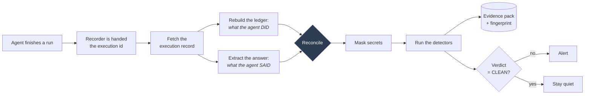
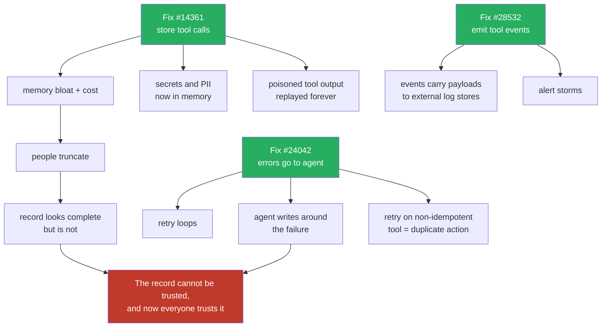
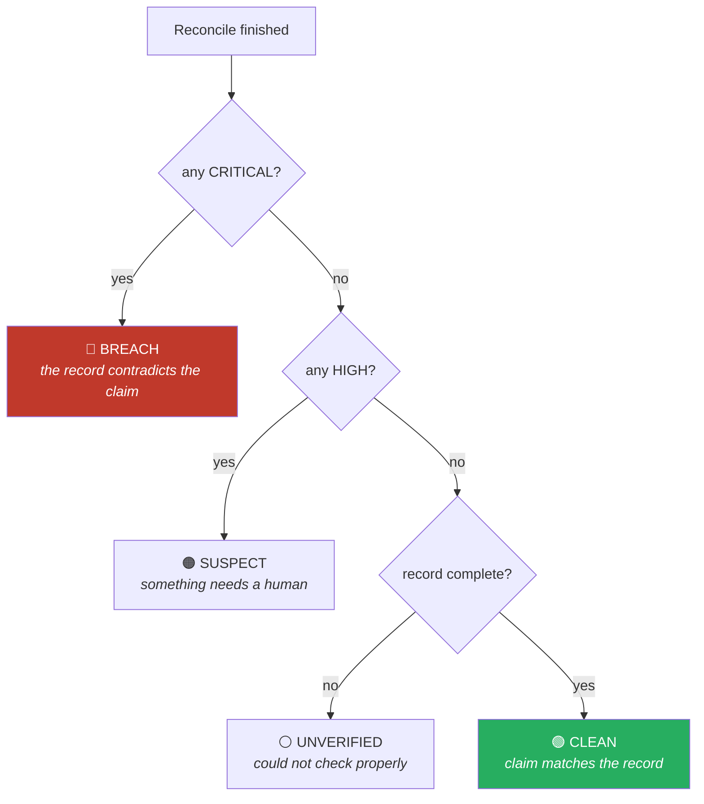

# The Agent Flight Recorder, and the bugs that arrive after the fix

This one is a proposal, not a war story. It is built on three open issues in the n8n tracker, a
guess about what breaks once those three are fixed, and a workflow that tries to catch the second
set of problems before anyone hits them.

I am putting the reasoning in front of the artifact, because the reasoning is the part I would want
argued with.

---

## Part 1. The problem, in plain language

An AI agent is a program that decides for itself which tools to call. You give it a goal and some
tools, it works out the sequence, and at the end it writes you a sentence describing what it did.

That last sentence is the part almost nobody checks.

If the agent says *"I looked up the order and emailed the customer"*, three things could be true:

1. It did both. Fine.
2. It looked up the order, the email tool failed, and it wrote the sentence anyway.
3. It did neither and wrote the sentence because that is what a helpful answer looks like.

From the outside, all three look identical. You get the same sentence. The workflow shows green.

You would think the fix is to go and read the log of what the agent actually did. Here is the
problem: **in n8n today, that log has three holes in it**, and each one is an open issue.

### The three holes

| Issue | What it means in plain terms |
|---|---|
| **#14361** (open since April 2025, 33 reactions, 56 comments) | The agent's memory stores what you said and what it said, but **not which tools it called**. The person who filed it wrote: *"Have you noticed the agent claiming that it called a tool but didn't? This is greatly aggravated by this problem."* |
| **#28532** (open) | The three most common tool types (sub-workflow, HTTP request, code) **emit no event at all** when they run, on success or failure. Anything watching from outside sees nothing. |
| **#24042** (open) | When a tool fails, the whole workflow dies instead of telling the agent. The agent never finds out its tool broke. |

Read them together and they say one thing. **An n8n AI agent has no trustworthy record of what it
actually did.** Memory drops the tool calls. The event stream drops the tool events. Errors never
reach the agent. So when the agent makes a claim, there is nothing in the system that can confirm it
or contradict it.

That is the same shape as the bug in [`07-platform-sentinel.md`](07-platform-sentinel.md), one level
up. A confident claim, no evidence behind it, and nothing failing anywhere.

### The trick that makes this fixable today

The evidence is not actually gone. It is in a fourth place that none of those three issues touch:
**the execution record**.

Every node run in n8n, including every tool a agent calls, leaves an entry in the execution data,
with its status, its timing, and its output. Memory does not see it. The event stream does not see
it. But the API will hand you the whole thing if you ask for it.

So the recorder does not wait for n8n to fix anything. It reads the execution record and rebuilds
the ledger of what really happened from there.

---

## Part 2. What it does



The core of it is one comparison:

```
The agent said:   "I checked the order and emailed the customer."

The record shows:  lookup_order   ran, 340ms, returned order 8812
                   send_email     never ran

Finding:           FABRICATED_ACTION  (critical)
```

That comparison is the whole idea. Everything else in the workflow exists to make that comparison
trustworthy, or to catch the ways it can go wrong.

---

## Part 3. The premortem, which is the actual work

Here is where I want to be useful rather than clever.

It is easy to build something that catches today's bug. The three issues above will get fixed;
they are all assigned to n8n teams. If the recorder only catches what is broken today, it is
obsolete the week those land.

So I did the exercise the other way round. **Assume all three are fixed. What breaks next?**

I am reasoning about consequences here, not reporting observed facts. Treat this section as a set
of predictions that can be checked, not as findings.

### Move 1. They fix #14361, so tool calls are stored in memory

The obvious win: the agent finally remembers what it called, and stops claiming tools it never used.

Then:

**Memory gets expensive and fills up.** Tool results are not small. An HTTP tool returning a
customer record, a database tool returning fifty rows, a search tool returning ten documents. All of
that now lands in the context window on every subsequent turn. Long conversations get costly and
eventually hit the limit.

**So people will truncate.** Store the first N characters of each tool result and drop the rest.
Entirely reasonable, and it quietly destroys the thing that made the record worth having. Now the
log is incomplete, but it *looks* complete, and everyone treats it as authoritative because "we
store tool calls now". That is the false GREEN again, wearing a different hat.

**Secrets and personal data move somewhere new.** Tool inputs and outputs contain API keys, customer
names, addresses, order details. Once that is in memory, it is in a store with its own retention
rules, often a different database from executions. A deletion request now has to reach into agent
memory as well, and probably nobody has wired that up.

**A poisoned tool result becomes permanent.** If a tool returns text that reads like an instruction,
and that text is now stored in memory, it gets replayed into the context of every later run. A
prompt injection that lands once stops being an incident and becomes a resident.

### Move 2. They fix #28532, so tool events are emitted

The obvious win: external monitoring can finally see tool calls.

Then:

**Event volume.** Every tool call becomes a log line shipped to an external destination. A busy agent
fleet turns into a firehose, and somebody pays per gigabyte for it.

**Secrets leave the building.** Those events carry tool inputs and outputs. n8n has a permission
model; the log aggregator they get shipped to usually has a looser one and a wider audience. Data
that was protected inside n8n is now sitting in a search index that half the company can query.

**Alert storms.** People will build alerts on these events, because that is what events are for. One
broken tool called in a loop becomes hundreds of identical alerts. That lesson is already written
down in `07`, and it will be relearned here.

### Move 3. They fix #24042, so tool errors go back to the agent

The obvious win: the agent can handle its own failures instead of the workflow dying.

Then, and this is the one I would put money on:

**Retry loops.** An agent that receives an error, and has a system prompt telling it to handle
errors gracefully, will try again. And again. Nothing in the model's training says "give up after
three". Cost and latency run away, and the workflow still looks like it is working.

**The failure goes silent.** This is the serious one. Today, a broken tool crashes the workflow. That
is ugly, and it is *honest*: somebody sees red and investigates. After the fix, the agent catches
the error and writes a plausible answer around it. The user reads a confident sentence. Nothing goes
red.

> Fixing the crash converts a loud failure into a quiet one. The system gets sturdier and less
> trustworthy at the same time, and those two things are easy to confuse.

**Duplicate side effects.** The nastiest version. A tool times out, so the agent gets an error and
retries. But the first call actually succeeded, the response just never came back. The customer gets
two emails. Or two refunds. Retry logic on a non-idempotent action is a footgun, and handing errors
to a component that reasons in natural language about whether to retry is a very sharp version of it.

### The chain, drawn out



Every green box is a real improvement. The red box is where they lead if nobody is watching for it.

---

## Part 4. Every detector traces back to a prediction

This is the part I would defend in a review. The detector set is not a brainstorm. Each one exists
because the premortem predicted a specific failure.

| Detector | Severity | Catches | Comes from |
|---|---|---|---|
| `FABRICATED_ACTION` | CRITICAL | Agent describes a real-world action, record shows no successful tool call | The symptom in #14361 today |
| `SILENT_RECOVERY` | HIGH | A tool failed and the answer never mentions it | Move 3, the failure going quiet |
| `DUPLICATE_SIDE_EFFECT` | CRITICAL | Same tool, identical input, more than once | Move 3, retry after timeout |
| `RETRY_STORM` | HIGH | One tool called more times than the threshold | Move 3, retry loops |
| `SECRET_IN_EVIDENCE` | CRITICAL | Secret-shaped values found in tool data, masked before storage | Move 1 and Move 2, data moving somewhere looser |
| `INJECTION_ECHO` | HIGH | Tool output contains instruction-shaped text | Move 1, poison becoming permanent |
| `EVIDENCE_TRUNCATED` | HIGH | A tool payload was larger than the cap, so the record is partial | Move 1, the truncation trap |
| `RECORDER_BLIND` | CRITICAL | The recorder could not read the record at all | Learned the hard way in `07` |

Two of those deserve a note.

**`SECRET_IN_EVIDENCE` masks first and reports second.** The values never reach the stored pack. But
the finding still fires, because a secret that passed through an agent's context has been exposed
whether or not it ends up in a log. Masking the record is not the same as containing the incident,
and reporting "we masked it" without saying "go rotate it" would be its own small lie.

**`RECORDER_BLIND` and `EVIDENCE_TRUNCATED` exist so the tool can call itself unreliable.** A verdict
of CLEAN is unreachable when the record is missing or partial. That rule is not new thinking, it is
the one lesson `07` cost me four bugs to learn, applied from version one instead of after the fact.

### What the verdicts mean



---

### The bug I shipped anyway

Worth recording, because it is the same mistake in a new place and I made it while writing the
section above warning about it.

The first version keyed each stored pack on the execution it examined: `PACK:112`. The dedupe then
refused to store any later pack for that execution. Which sounds right, until you notice what
actually happened: the first run could not read the record, so it stored a pack saying *"we could
not check this"*. That pack claimed the key. Attach the credential, re-run, get a real verdict, and
the dedupe rejects it. **The permanent record of that execution would have read "unchecked" forever,
including after it was checked.**

The key identified the thing being examined, not the examination. A dedupe key that cannot tell two
different outcomes apart is not removing noise, it is choosing which truth to keep.

The fix is to key on execution plus fingerprint. Re-examining an execution and reaching the same
conclusion still collapses to one row. Reaching a different conclusion appends a new one, and the
history shows the recorder was blind and then was not. For an evidence trail that is the correct
behaviour anyway: append, never overwrite.

---

## Part 5. The evidence pack, and why it is shaped like that

Each run produces one stored pack: the execution it covers, the verdict, how many tools ran, how
many claims were made, how many were unsupported, the coverage statement, the findings, and a
fingerprint.

The fingerprint is a deterministic hash of the ledger, the claims, and the findings. If somebody
edits a stored pack afterwards, the fingerprint no longer matches the contents.

**Be clear about what that is and is not.** It is a content fingerprint computed in a Code node, not
a cryptographic signature. It detects casual editing. It does not stop a determined person with
database access from recomputing it. Calling it a seal would oversell it, so I am not calling it one.

The shape comes from somewhere specific. In an earlier piece of work I designed an evidence pack for
a regulated employment process, where the point was that a third party could check a process had
been followed without having to trust the people who ran it. An AI agent that touches customers
needs exactly the same thing and mostly does not have it. What is stored here is meant to be read by
someone who was not there and does not trust you.

---

## Part 6. What it cannot do

Same spirit as [`06-limitations.md`](06-limitations.md). If I were reviewing this, these are the
holes I would go for.

**Claim detection is keyword matching, and that is genuinely weak.** It looks for past-tense
side-effecting verbs in the agent's answer. It will miss a claim phrased unusually, and it will fire
on the word "sent" in a sentence about something else. It is deliberately biased toward missing
claims rather than inventing them, because a false accusation of fabrication is worse than a quiet
miss, but I would not describe this as solved. The honest upgrade is a small model scoring
claim-versus-evidence pairs, which costs money per run and needs its own evaluation before I would
trust it more than the crude version.

**`FABRICATED_ACTION` only fires in the clearest case.** Side-effect claim, and zero successful tool
calls in the whole run. An agent that calls one tool and lies about a second one gets past it. Doing
better means mapping individual claims to individual tools, which needs either a naming convention
or a model.

**It cannot see actions taken outside n8n.** If the agent's tool is a sub-workflow that calls a
service which does the real work, the recorder sees the sub-workflow ran, not what the service did.

**It has never seen a real agent run.** The workflow has been executed and its blindness detector
fires correctly, but the tool ledger has not yet been built from a live agent with real tool calls.
Until it has, the extraction logic is untested against the thing it was written for. That is the
first thing to fix and I would rather say so than let a diagram imply otherwise.

**The premortem is reasoning, not evidence.** Part 3 is a prediction about second-order effects.
Some of it will be wrong. It is written down so it can be checked later, which is the only useful
form for a prediction to take.

**Idempotency is assumed, not known.** `DUPLICATE_SIDE_EFFECT` fires on any repeated tool call with
identical input, but plenty of tools are safely idempotent and repeating them is harmless. Without a
per-tool declaration of which are safe to repeat, this will produce false positives. The registry
that would fix it is the obvious next piece.

---

## Part 7. What I would build next, in order

1. **Run it against a real agent.** Everything else is theory until the ledger has been rebuilt from
   a live run with real tool calls.
2. **A tool registry** declaring which tools are idempotent and which have real-world side effects.
   That single table sharpens `DUPLICATE_SIDE_EFFECT`, `FABRICATED_ACTION` and `RETRY_STORM` at once.
3. **Deliberately break things and confirm the detectors fire.** Force a tool failure and confirm
   `SILENT_RECOVERY`. Feed a tool output containing "ignore previous instructions" and confirm
   `INJECTION_ECHO`. A detector that has never fired in anger is a hypothesis.
4. **Trend the packs.** One pack is an incident. A thousand packs answer the question worth asking,
   which is whether this agent is getting more honest or less over time.

---

## The one-line version

Three open issues mean an n8n agent cannot prove what it did. The evidence still exists in the
execution record, so you can rebuild the ledger today without waiting for a fix. And the more
interesting problems are the ones that arrive *after* the fix, when a crash becomes a graceful
recovery and a graceful recovery becomes a confident sentence that nobody can check.
